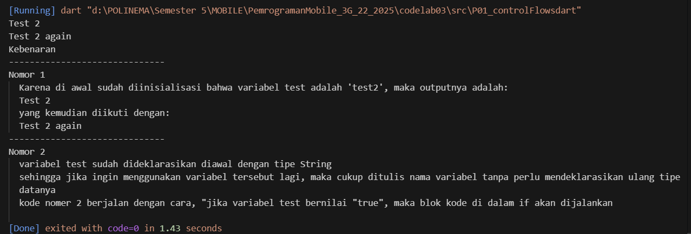

## RANGGA DWI SAPUTRA
Pertemuan 3 
NIM : 2341720248
Kelas : TI 3G

Praktikum 1 - Control Flow  
1.1  Karena di awal sudah diinisialisasi bahwa variabel test adalah 'test2', maka outputnya adalah:
  `Test 2` 
  yang kemudian diikuti dengan: 
  `Test 2 again`
  Eror output pada block ini dikarenakan penggunaan huruf kapital If - Else yang tidak konsisten

1.2 
  variabel test sudah dideklarasikan diawal dengan tipe String
  sehingga jika ingin menggunakan variabel tersebut lagi, maka cukup ditulis nama variabel tanpa perlu mendeklarasikan ulang tipe datanya
  kode nomer 2 berjalan dengan cara, "jika variabel test bernilai "true", maka blok kode di dalam if akan dijalankan
  Eror terjadi karena variabel test dideklarasikan 2 kali dalam 1 fungsi main dengan tipe data String, untuk memperbaikinya cukup hapus String deklarasi test yang ke 2  
  Hasil dari praktikum satu bisa dilihat pada gambar berikut,
  

Praktikum 2 - Looping While - Do  
2.1 Eror terjadi karena variabel counter belum didefinisikan, sehingga program bingung eror isi awalnya apa
    Kode 'while' berjalan dengan cara var counter yang sudah dikasi nilai awal akan ditampilkan dengan nilai yang terus bertambah nilainya selama kurang dari 33
    Hasilnya bisa dilihat pada gambar berikut,
  
  .png)

2.2 Kode 'do-while' tersebut akan menampilkan nilai dari counter, yang setiap iterasi nilainya akan terus bertambah selama kurang dari 77
    Nilai counter awal pada program didapat dari sisa berjalannya program 'while' sebelumnya
    Hasilnya bisa dilihat pada gambar berikut,
  .png)

Praktikum 3 - For Looping  
3.1
    Eror disebabkan karena adanya inkonsistensi variabel Index, untuk memperbaikinya perlu disamakan besar kecilnya
    Block kode program for tersebut akan menampilkan nilai index dimulai dengan angka 10 yang akan terus bertambah nilainya selama kurang dari 27
     Hasilnya bisa dilihat pada gambar berikut,
  

3.2
  Sebenarnya block kode tersebut bisa berjalan, namun tidak menampilkan apa apa karena kondisinya adalah "jika di angka 21, maka di skip" dan Karena bagian else if (Index > 1 || Index < 7) itu selalu true untuk semua nilai Index dalam loop, jadi print(Index) tidak pernah dieksekusi.  
  Hasilnya bisa dilihat pada gambar berikut,
    
  Jika hasil yang diinginkan hanya skip angka antara 1–7, maka harus pakai `&&` dan mendapatkan hasil sebagai berikut,
  