# RANGGA DWI SAPUTRA
<table>
  <tr>
    <td>NIM</td>
    <td>2341720248</td>
  </tr>
  <tr>
    <td>Kelas</td>
    <td>TI 3G</td>
  </tr>
  <tr>
    <td>Pertemuan 4</td>
    <td>Dart Bagian 3</td>
  </tr>
</table>
<hr>

## Praktikum 1 : Eksperimen Tipe Data List
1.1 Variable list menyimpan nilai array `1, 2, 3`. `assert` gunanya untuk mengecek kondisi (debugging check). Jika nilai list.length (panjangnya) 3 dan bernilai true maka lanjut ke baris selanjutnya. Baris selanjutnya mengecek apakah array list index 1 bernilai 2. <br>

Jika true semua maka print panjangnya variable list, yaitu 3; dan print list index 1, yaitu 2. <br> Di baris selanjutnya dideklarasikan bahwa nilai list index 1 adalah 1. Lalu dicek pakai `assert`, jika benar maka print nilai 1. Meskipun di awal index 1 adalah 2, tapi di baris terdekat dideklarasikan ulang. Sehingga yang muncul adalah `3, 2, 1` <br>

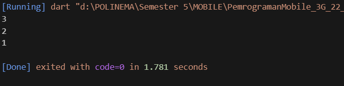

1.2 Awalnya eror karena variable List dibikin tanpa tipe data dan eror ketika memasukkan tipe data String. Dengan `<String?>` berarti bisa bernilai string atau null dengan length di set 5. Kemudian index 1 dan 2 dikasi nilai Nama dan Nim, lalu tinggal di print. Dan dihasilkan output sebagai berikut <br><br>
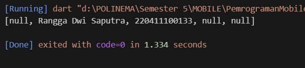

## Praktikum 2 : Eksperimen Tipe Data Set
2.1 Variable bernama hallogens di deklarasikan dengan nilai string `{'fluorine', 'chlorine', 'bromine', 'iodine', 'astatine'}` yang kemudian di print. Yang terjadi adalah semua nilai yang ada di variable tersebut ditampilkan. Seperti pada gambar berikut,

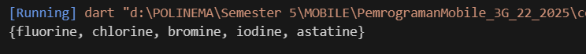

2.2 `names1` dan `names2` adalah Set kosong bertipe String. `names1.add(...)` → menambahkan satu elemen. `names2.addAll({...})` → menambahkan beberapa elemen sekaligus. Bisa dilihat hasil sebagai berikut: <br>

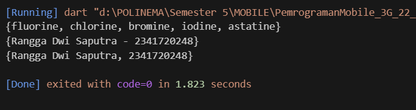

## Praktikum 3 : Eksperimen Tipe Data Maps
3.1 `gifts` adalah sebuah Map dengan key berupa String `('first', 'second', 'fifth')` dan value campuran (String dan int). Sedangkan `nobleGases` juga sebuah Map, tapi key berupa int `(2, 10, 18)` dengan value campuran (String dan int).  Berikut hasil run programnya : <br>

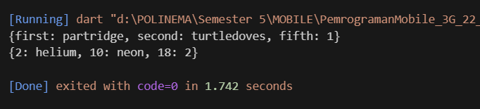

Dart memperbolehkan Map memiliki tipe data berbeda untuk value-nya, selama dideklarasikan dengan var (Dart akan menganggap tipenya `Map<dynamic, dynamic>`).

3.2 `var mhs1` dan `var mhs2` dideklarasikan namun tidak pernah dipakai. Alih-alih mengisi variable tersebut, kode tersebut malah mengisi variable gift. `Map<String, String>();` difungsikan agar nilai dalam variable tersebut harus bertipe data String. `Map<int, String>();` difungsikan agar nilai dalam variable tersebut harus bertipe data Int dan String. <br>
Sebenarnya tidak ada yang eror dari block program tersebut. Hanya saja variable mhs1 dan mhs2 tidak terbaca karena memang tidak pernah di print. Kalaupun mau diperbaiki, semua nilai gifts jadi mhs1 dan noobleGlasses jadi mhs2 dengan hasil sebagai berikut: <br>

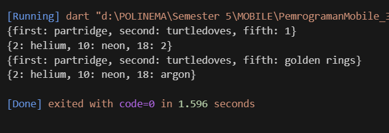
<br>
Berikut hasil modifikasi dengan menambahkan nim dan nama
<br>
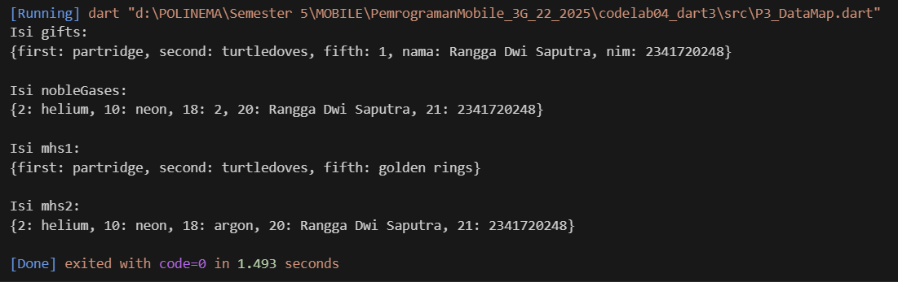

## Praktikum 4 : Eksperimen Tipe Data List Spread dan Control-flow Operators
4.1 `Pada langkah 1`, Eror terjadi karena ada variabel list1 yang tidak dideklarasikan (sebelumnya 'list'), maka disamakan (diganti jadi 'list'). Kode berjalan dengan menampilkan semua nilai dalam var 'list'. `...list` digunakan untuk memanggil semua nilai yang ada di variabel 'list, setelah ditambahi 0 diawal. Sedangkan `.length` untuk menghitung total index yang ada didalamnya. Bisa dilihat pada gambar berikut, <br>

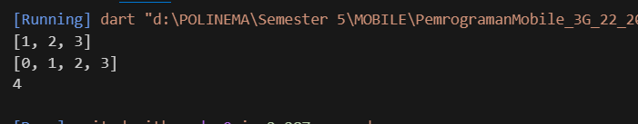

4.2 'list1' `Pada langkah 3` belum pernah dideklarasikan dengan tipe nullable list.
Program tidak tau 'list1' itu apa → otomatis dianggap non-nullable jika tidak diberi tipe. Maka dari itu perlu `List<int?>?` untuk memberitahunya. `list3` diisi dengan nilai `[0, ...list1]`. list1 isinya ada 1, 2, dan null (3) + 0 (pada list3) jadi nilai `.length`nya adalah 4. Hasil running kode program sebagai berikut, <br>

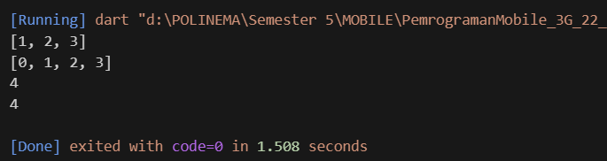
Berikut hasil modifikasi dengan ditambahkan NIM dan NAMA

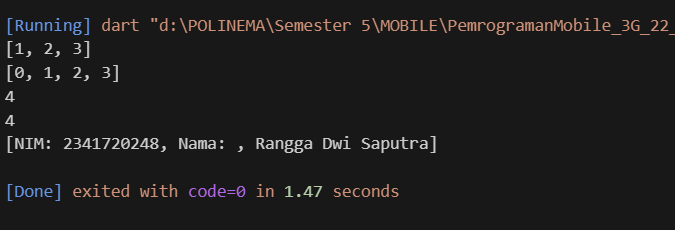

4.3 Penyebab eror pada `langkah 4` ini adalah tidak Deklarasikan dulu promoActive sebagai bool (true/false). Kalau promoActive = true → 'Outlet' ikut dimasukkan ke list. <br>

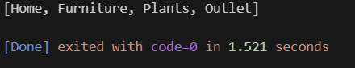

Kalau promoActive = false → 'Outlet' tidak dimasukkan.

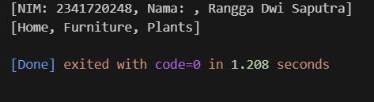

4.4 `Pada langkah 5` di dalam if (...) pakai syntax login case 'Manager'. `if` tidak mengenali `case`. Sedangkan `case` hanya boleh dipakai dalam `switch`. Untuk cek apakah `login` bernilai 'Manager', cukup pakai perbandingan `==`,

```dart
  var login = 'Manager';
  var nav2 = [
    'Home',
    'Furniture',
    'Plants',
    if (login == 'Manager') 'Inventory',
  ];
  print(nav2);
```
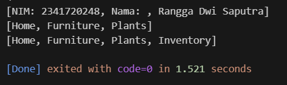

Jika `login` bernilai selain 'Manager', misalnya :
```dart
var login = 'Manager';
  var nav2 = [
    'Home',
    'Furniture',
    'Plants',
    if (login == 'User') 'Inventory',
  ];
  print(nav2);
```
maka dihaislkan output sebagai berikut:
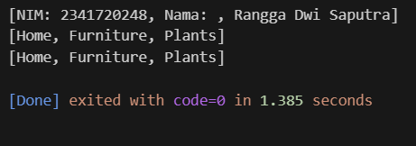

4.5 `Langkah 6` ini valid dan tidak ada error. `[for (var i in listOfInts) '#$i']` akan otomatis men-generate elemen list. Sebagaimana gamabr berikut:

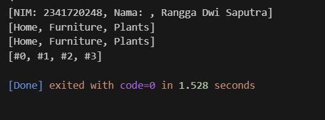


## Praktikum 5: Eksperimen Tipe Data Records
5.1 `Pada langkah 1` aturan default toString record menampilkan named dulu baru positional. Itulah yang menyebabkan kenapa kok 'last' di print duluan (setelah 'first') di output.

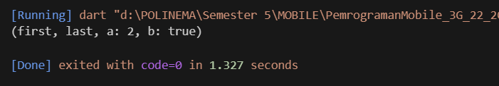

5.2 `Pada langkah 3` dapat dilihat hasil sebagai berikut

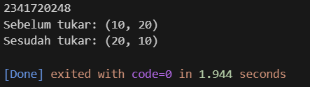

5.3 `Pada langkah 4` `(String, int)` mahasiswa;, ini mendeklarasikan sebuah variabel record bertipe `(String, int)` tetapi tidak diinisialisasi. Kalau langsung dicetak `print(mahasiswa);`, maka terjadi error. Perlu diisi field record mahasiswa dengan nama (String) dan NIM (int)

```dart
  (String, int) mahasiswa = ('Rangga Dwi Saputra', 2341720248);
  print(mahasiswa);
```
Dengan hasil sebagai berikut, <br>
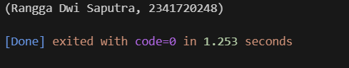

5.4 `Langkah 5` membuat record bernama mahasiswa2 dengan kombinasi field positional dan named field. Field pertama 'first' bisa diakses dengan mahasiswa2.$1, lalu field a dan b bisa diakses dengan nama masing-masing (mahasiswa2.a, mahasiswa2.b), dan field terakhir 'last' berada di posisi kedua sehingga diakses dengan mahasiswa2.$2. Hasil eksekusi akan mencetak first, 2, true, dan last. Ini menunjukkan bahwa di Dart record mendukung akses elemen berdasarkan urutan (positional) maupun nama (named). Berikut setelah diganti dengan nama dan nim

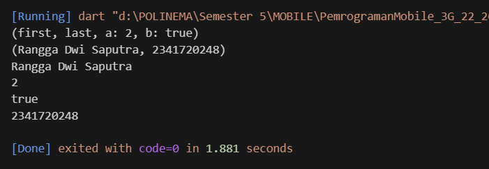

## Tugas Praktikum
1. Jelaskan yang dimaksud Functions dalam bahasa Dart!
2. Jelaskan jenis-jenis parameter di Functions beserta contoh sintaksnya!
3. Jelaskan maksud Functions sebagai first-class objects beserta contoh sintaknya!
4. Apa itu Anonymous Functions? Jelaskan dan berikan contohnya!
5. Jelaskan perbedaan Lexical scope dan Lexical closures! Berikan contohnya!
6. Jelaskan dengan contoh cara membuat return multiple value di Functions!
<hr>

## Jawaban
1. Function adalah blok kode yang bisa dipanggil untuk menjalankan tugas tertentu, membantu menghindari pengulangan kode.
2. Positional: urutannya wajib sesuai. Optional positional: dibungkus [], boleh diisi atau tidak. Named: dibungkus {}, dipanggil berdasarkan nama.
3. Function bisa disimpan di variabel, dikirim sebagai argumen, atau dikembalikan sebagai nilai.
4. Function tanpa nama, biasanya dipakai cepat di dalam ekspresi.
5. Lexical scope: variabel bisa diakses sesuai posisi deklarasinya. Lexical closure: function “mengingat” variabel luar walau scope luar selesai.
6. Gunakan record untuk mengembalikan banyak nilai. <br>

  ```dart
  (String, int) getData() => ('Rangga', 22040123);
  var (nama, nim) = getData();
  ```
