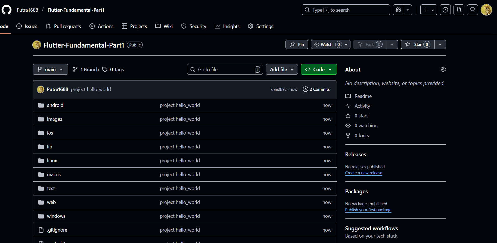
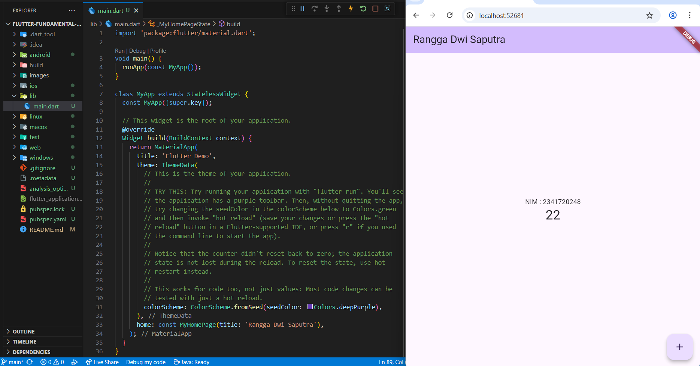
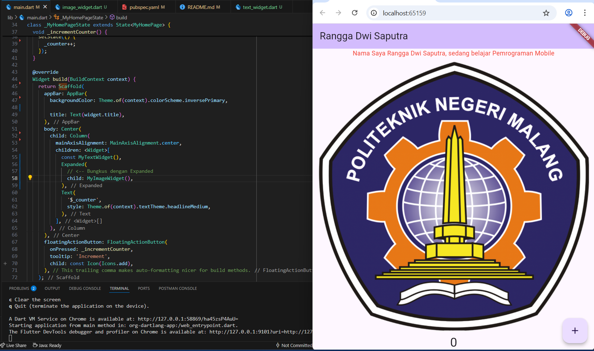

# Hello_World

A new Flutter project.

## Getting Started
### Prakikum 1 : Membuat Project Flutter Baru
1. Untuk membuat project flutter baru di VS Code kita perlu mengetukkan `Ctrl + Shift + P` kemudian dilanjutkan dengan `New Flutter Project` dan pilih `Aplication`. Secara otomatis akan terbuild folder dan code seperti gambar berikut: 

    

2. Bisa disimpan di folder sesuai keinginan. 

### Praktikum 2: Menghubungkan Perangkat Android atau Emulator
1. Aktifkan mode pengembang di hp android dengan membuka `Settings --> Tentang ponsel` cari nomor versinya (klik Versi) dan tekan-tekan.
2. Pergi ke menu `opsi developer` di menu 'Pengaturan tambahan' --> aktifkan `Debugging USB`
3. Sambungkan usb dari laptop - Hp
4. Di terminal coba cek `flutter device`

       sudah terhubung dengan ada nomor versi hp
5. Jalankan `flutter run`, tunggu sebentar dan akhirnya muncul di hp

### Praktikum 3: Membuat Repository GitHub dan Laporan Praktikum
1. Berikut repository dengan seluruh folder dan file project 'hello_world'

    

2. `Start Debugging` bisa langsung dijalankan dengan chrome, dengan karakteristik sebagai berikut
    
    - Flutter build jadi aplikasi web.
    - Startup cepat, laptop tidak terlalu berat.
    - Cocok buat latihan UI/UX cepat.
    - Keterbatasan: banyak plugin Android/iOS gak bisa dipakai (contoh: kamera, GPS, notifikasi push, Bluetooth, dll).

3. Project 'hello_world' sudah bisa dimodifikasikan, berikut hasilnya

    

### Praktikum 4: Widget Dasar
1. Menambahkan Text dan Image Widget dengan hasil run sebagai berikut

    

### Praktikum 5: Widget Material Design dan iOS Cupertino
1. 