# Hello_World

A new Flutter project.

## Getting Started
### Prakikum 1 : Membuat Project Flutter Baru
1. Untuk membuat project flutter baru di VS Code kita perlu mengetukkan `Ctrl + Shift + P` kemudian dilanjutkan dengan `New Flutter Project` dan pilih `Aplication`. Secara otomatis akan terbuild folder dan code seperti gambar berikut: 

    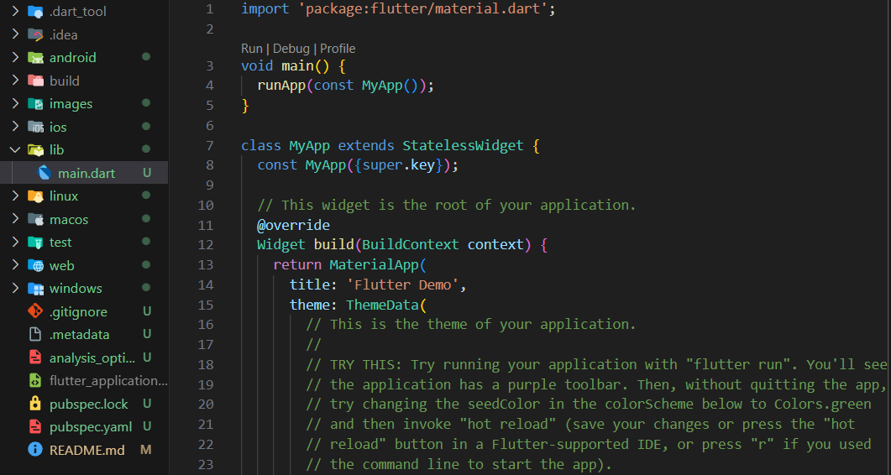

2. Bisa disimpan di folder sesuai keinginan. 

### Praktikum 2: Menghubungkan Perangkat Android atau Emulator
1. Aktifkan mode pengembang di hp android dengan membuka `Settings --> Tentang ponsel` cari nomor versinya (klik Versi) dan tekan-tekan.
2. Pergi ke menu `opsi developer` di menu 'Pengaturan tambahan' --> aktifkan `Debugging USB`
3. Sambungkan usb dari laptop - Hp
4. Di terminal coba cek `flutter device`

    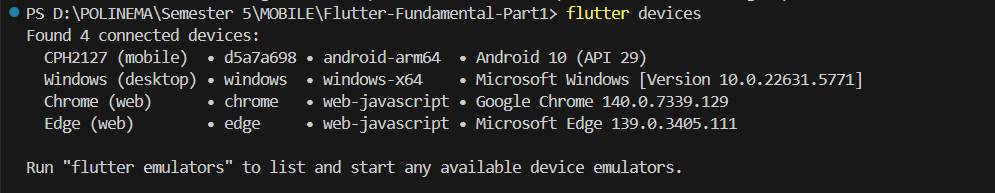   sudah terhubung dengan ada nomor versi hp
5. Jalankan `flutter run`, tunggu sebentar dan akhirnya muncul di hp

### Praktikum 3: Membuat Repository GitHub dan Laporan Praktikum
1. Berikut repository dengan seluruh folder dan file project 'hello_world'

    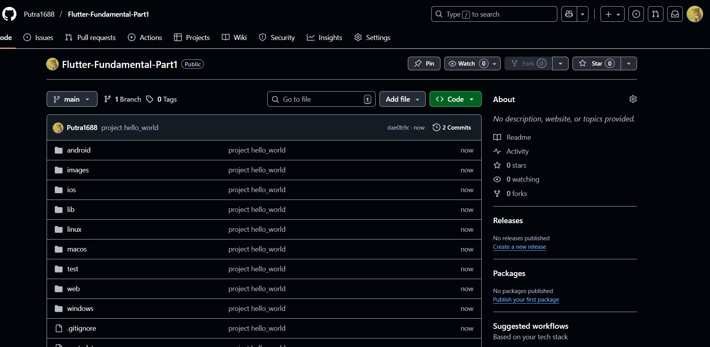

2. `Start Debugging` bisa langsung dijalankan dengan chrome, dengan karakteristik sebagai berikut
    
    - Flutter build jadi aplikasi web.
    - Startup cepat, laptop tidak terlalu berat.
    - Cocok buat latihan UI/UX cepat.
    - Keterbatasan: banyak plugin Android/iOS gak bisa dipakai (contoh: kamera, GPS, notifikasi push, Bluetooth, dll).

3. Project 'hello_world' sudah bisa dimodifikasikan, berikut hasilnya

    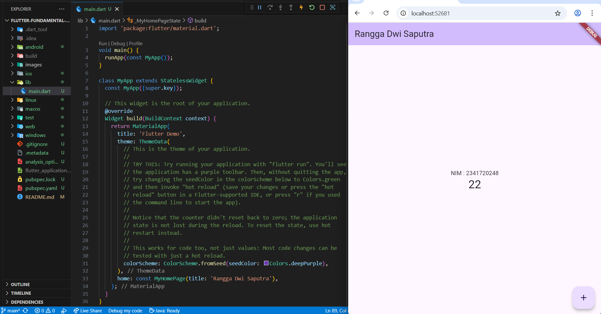

### Praktikum 4: Widget Dasar
1. Menambahkan Text dan Image Widget dengan hasil run sebagai berikut

    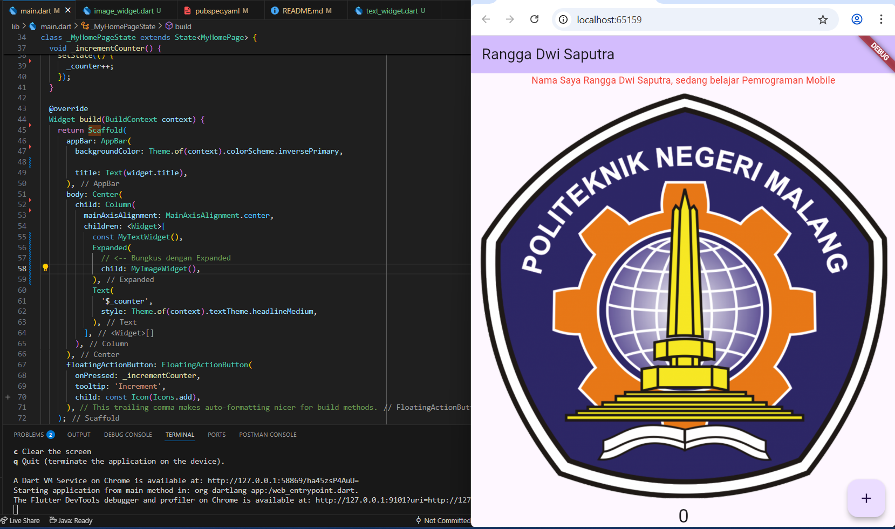

### Praktikum 5: Widget Material Design dan iOS Cupertino
1. Berikut hasil dari kode program untuk Cupertino Button dan Loading Bar
    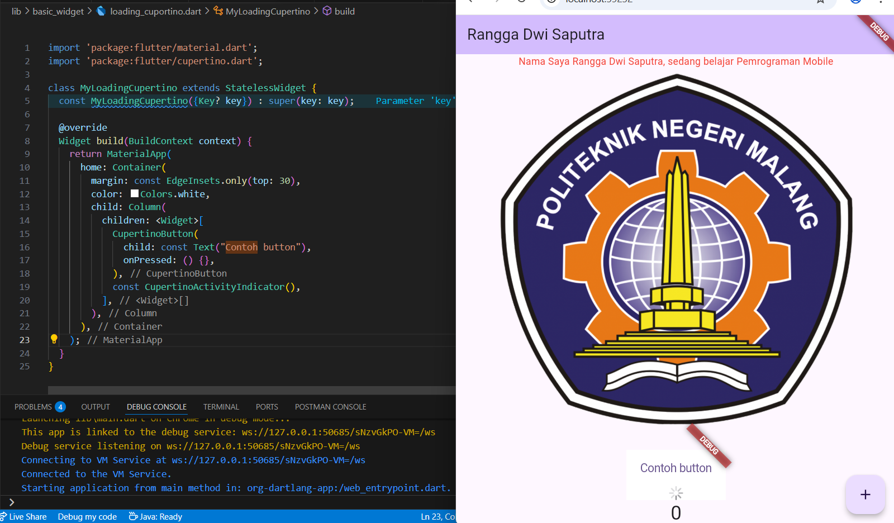

2. Berikut hasil dari penggunaan Floating Action Button (FAB)

    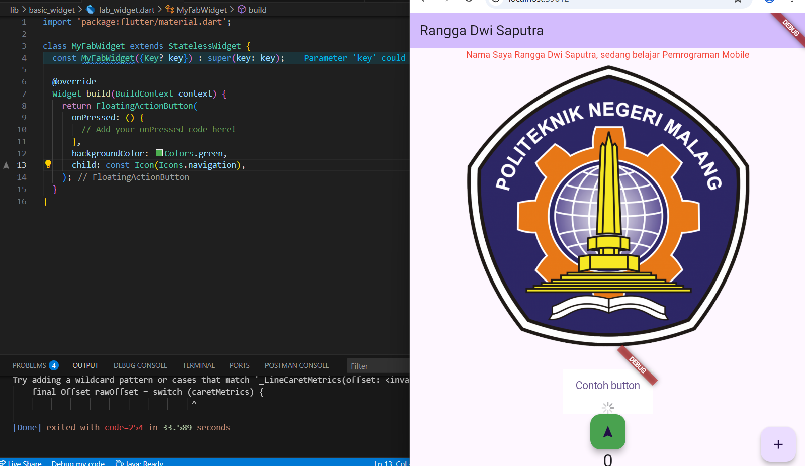

3. Berikut hasil dari Scaffold Widget

    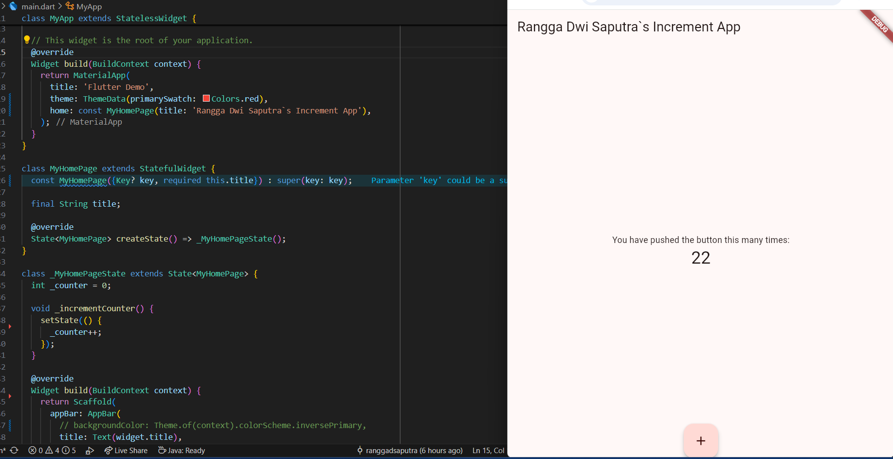

4. Berikut hasil dari Dialog Widget

    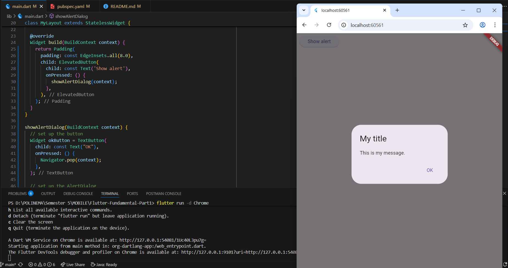

5. Berikut hasil dari Input dan Selection Widget

    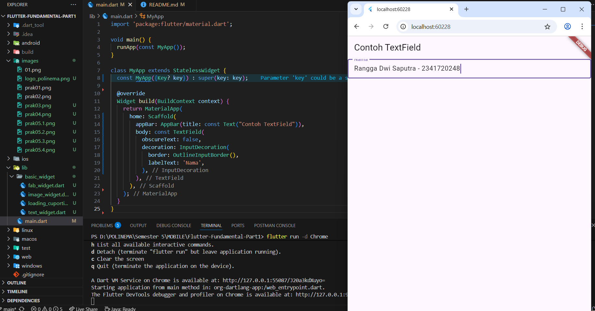

6. Berikut hasil dari Date and Time Pickers

    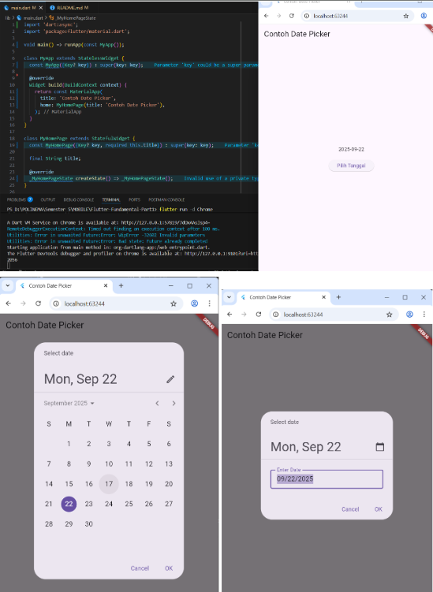

### Tugas Praktikum
2. Berikut tampilan aplikasi pada perangkat fisik

    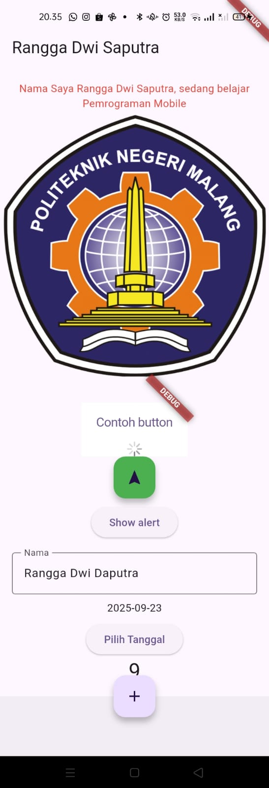

3. File widget sudah saya buat dan kumpulkan di folder basic_widgets dan dijalankan di main seperti gambar berikut :

    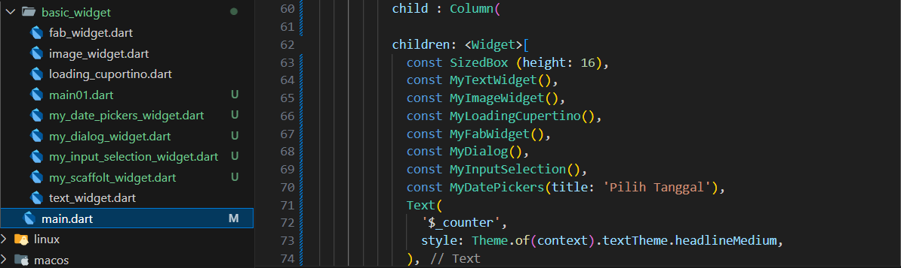

4. 
