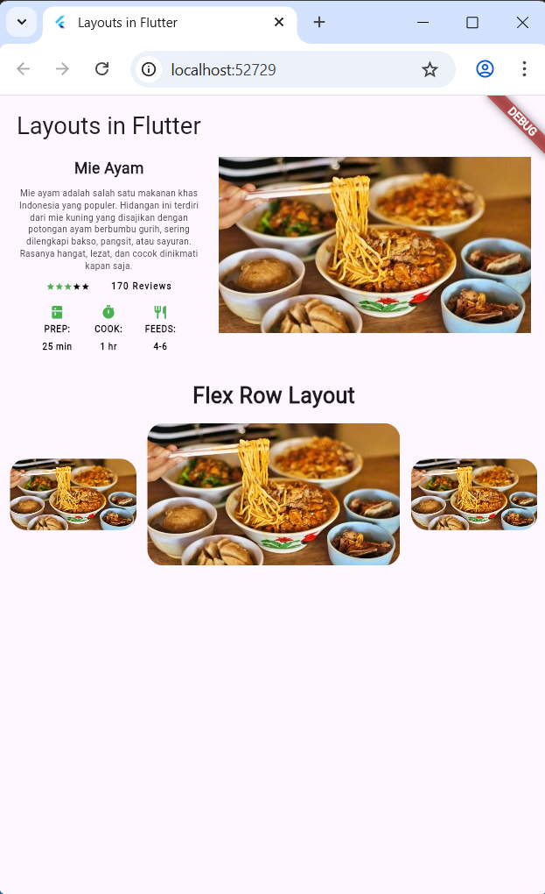

# RANGGA DWI SAPUTRA
<table>
  <tr>
    <td>NIM</td>
    <td>2341720248</td>
  </tr>
  <tr>
    <td>Kelas</td>
    <td>TI 3G</td>
  </tr>
  <tr>
    <td>Pertemuan 6</td>
    <td>Flutter Basic Layout</td>
  </tr>
</table>
<hr>

# basic_layout_flutter

A new Flutter project.

## Tugas Praktikum 1
Program ini adalah praktik penerapan basic layout flutter dari panduan link [flutter ini](https://docs.flutter.dev/codelabs/layout-basics) . Kode tersebut di Implementasikan dalam satu file main dengan susunan bagian berikut ini:

1. Judul & Deskripsi
    ```
    final titleText
    final descriptionText
    ```

2. Rating & Review
    ```
    final stars
    final ratings
    ```

3. Icon List
    ```
    const descTextStyle
    final iconList
    ```

4. Yang kemudian ketiganya di gabung dalam satu Column melalui kode berikut:
    ```
    // LEFT COLUMN
    final leftColumn = Container(
      padding: const EdgeInsets.fromLTRB(16.0, 0, 16.0, 0),

      child: Column(
        crossAxisAlignment: CrossAxisAlignment.center,
        children: [titleText, descriptionText, ratings, iconList],
      ),
    );
    ```

5. Khusus untuk Image `finl mainImage`
6. Kemudian digabung menjadi satu melalui
    ```
    final mainLayout = Row(
      crossAxisAlignment: CrossAxisAlignment.start, // Agar rata atas
      children: [
        // Bagian kiri (teks), mengambil 2/5 ruang
        Expanded(
          flex: 2, // Menentukan rasio pembagian ruang
          child: leftColumn,
        ),
        // Bagian kanan (gambar), mengambil 3/5 ruang
        Expanded(
          flex: 3, // Menentukan rasio pembagian ruang
          child: mainImage,
        ),
      ],
    );
    ```

7. Saya juga menambahkan praktik dari Flex Row Layout : 3 Gambar dengan gambar tengah yang besar

8. Didapatkan hasil sebagai berikut :

    


