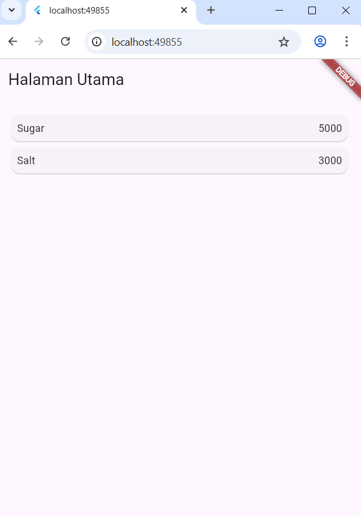

# RANGGA DWI SAPUTRA

<table>
  <tr>
    <td>NIM</td>
    <td>2341720248</td>
  </tr>
  <tr>
    <td>Kelas</td>
    <td>TI 3G</td>
  </tr>
  <tr>
    <td>Pertemuan 6</td>
    <td>Navigasi Flutter - Aplikasi belanja</td>
  </tr>
</table>

# belanja

A new Flutter project.

## Getting started

1. Siapkan project flutter, dalam folder `lib` buat folder `models`,`pages`, dan `widgets`
2. Buat aplikasi `home_page.dart` dan `item_page.dart`
3. Definisikan route di `main.dart`
4. Membuat data model
5. Pada `HomePage` definisikan `ListView` dengan Sumber datanya dari model list object item.
6. Membuat ListView dan itemBuilder

    
    
7. Menambahkan aksi pada ListView

    [Klik untuk menonton video](https://drive.google.com/file/d/14bMAY8OazNdrAmlRtw_C9hyh-AlHuZCl/view?usp=sharing)

## Tugas Praktikum 2 : Build Aplikasi Belanja

1. Tambahkan informasi arguments pada penggunaan Navigator
2. Pembacaan nilai yang dikirimkan pada halaman sebelumnya dapat dilakukan menggunakan ModalRoute. Tambahkan pada blok fungsi build dalam halaman ItemPage.
3. Pada hasil akhir dari aplikasi belanja yang telah anda selesaikan, tambahkan atribut foto produk, stok, dan rating.

    [Klik untuk menonton video](https://drive.google.com/file/d/14bMAY8OazNdrAmlRtw_C9hyh-AlHuZCl/view?usp=drive_link)

4. Implementasikan Hero widget pada aplikasi
5. Pecah widget menjadi kode yang lebih kecil. Tambahkan Nama dan NIM di footer aplikasi
6. Sesuaikan dan modifikasi tampilan sehingga menjadi aplikasi yang menarik

    [Klik untuk menonton video](https://drive.google.com/file/d/1GNDMYeAGDBVnaezE2e1qfqqgL9QwZOa3/view?usp=sharing)

