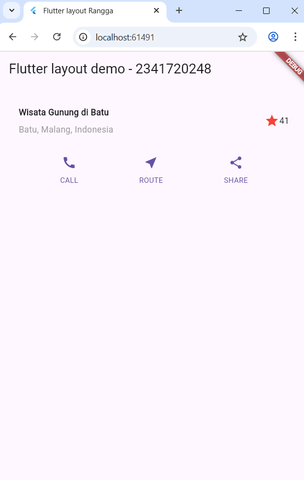
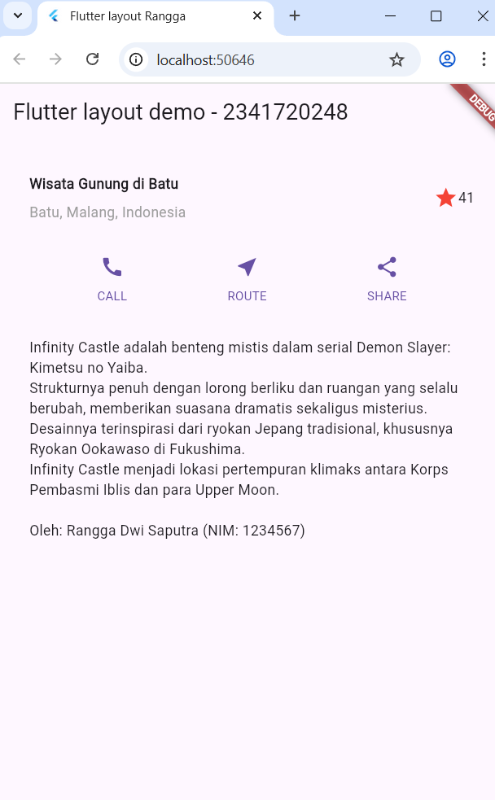
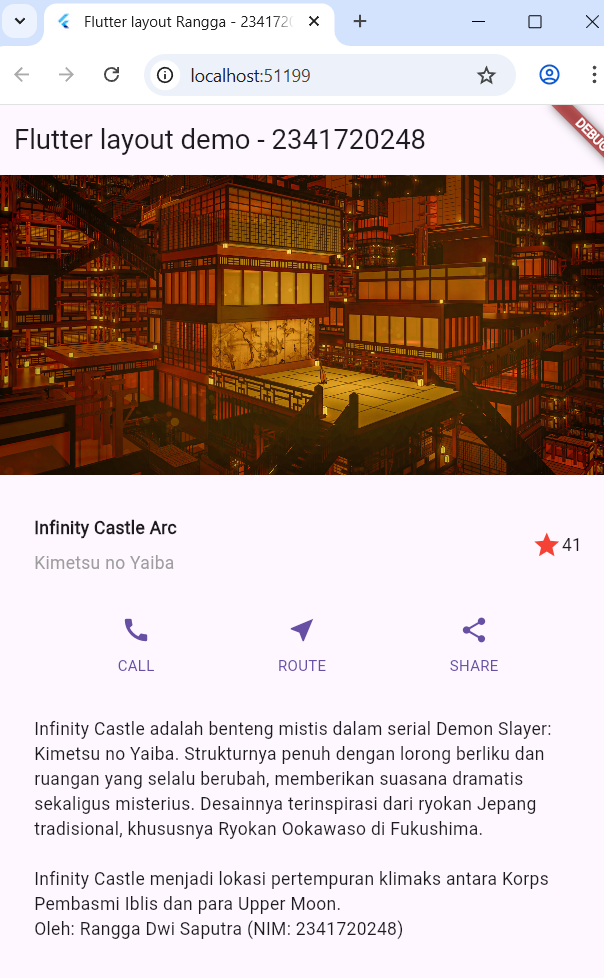

# RANGGA DWI SAPUTRA
<table>
  <tr>
    <td>NIM</td>
    <td>2341720248</td>
  </tr>
  <tr>
    <td>Kelas</td>
    <td>TI 3G</td>
  </tr>
  <tr>
    <td>Pertemuan </td>
    <td>Flutter Aplikasi Pertama</td>
  </tr>
</table>
<hr>

# codelab06_layout_flutter

A new Flutter project.

## Getting Started
### Praktikum 1 : Membangun Layout di Flutter
1. Buat project baru
2. Modifikasi file `lib/main.dart`
3. Impelementasi title row

    - `CrossAxisAligment.start`
    - `padding : 8`
    - style color
        ```
        style: TextStyle(
            color: Colors.gray[500]
        ),
        ```
    - body dengan `child: Text` dihapus dan diganti dengan `children: titleSelection`

    Berikut hasil dari praktikum 1: <br>
    

### Praktikum 2 : Implementasi button row
1. Buat methode Column `_buildButtonColumn` yang diletakkan diluar `Widget build()` tapi masih berada di dalam class `MyApp()`
2. Widget buttonSection setelah block kode `Widget titleSection`, sebelum retun.
3. Tambahkan section ke body (return)

    Berikut hasil dari praktikum 2 :

    

### Praktikum 3 : Impelementasi Text Section
1. Buat widget textSection
2. Tambahkan di dalam widget build sebelum return

    Berikut hasil dari praktikum 3 :

    

### Praktikum 4 : Implementasi Image Section
1. Tambahkan image, registrasikan image di pubspec.yaml, dan masukin image.asset ke dalam return
2. Berikut hasilnya :

     

