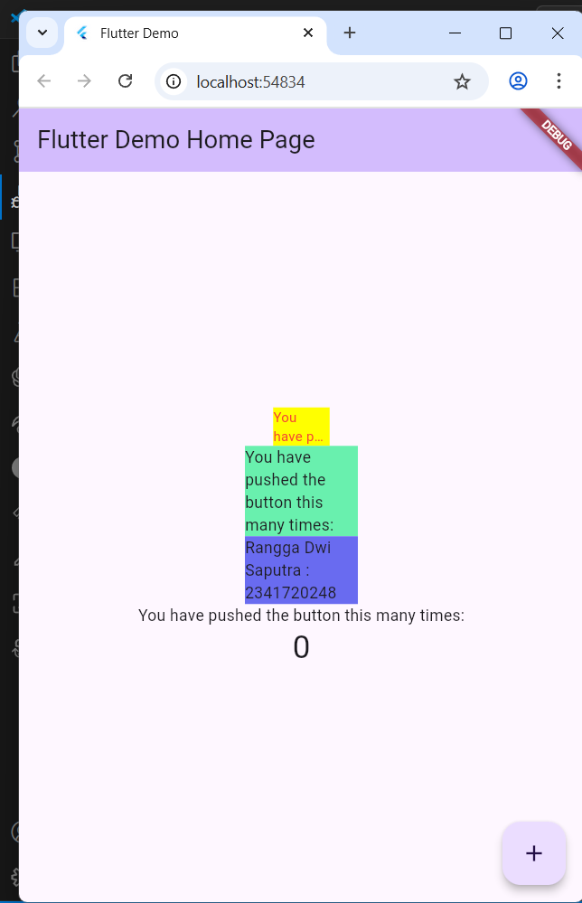

# flutter_plugin_pubdev

A new Flutter project.

## Tugas Praktikum
1. Berikut hasilnya :

    

2. Maksud dari langkah 2 adalah untuk menambahkan package auto_size_text ke dalam proyek Flutter Anda. Karena `auto_size_text` adalah sebuah widget tambahan yang tidak disediakan secara default oleh Flutter. Widget ini berfungsi untuk menyesuaikan ukuran teks secara otomatis agar pas dengan area yang tersedia, sehingga teks tidak terpotong atau overflow.
3. Maksud dari langkah 5 adalah cara yang benar dan umum digunakan di Flutter untuk membuat widget yang dapat menerima data dari luar.
4. Pada langkah 6 terdapat dua widget yang ditambahkan, jelaskan fungsi dan perbedaannya!

    - keduanya berfungsi untuk membuat sebuah kotak berwarna yang berisi teks. Perbedaan utamanya terletak pada jenis widget teks yang digunakan di dalamnya, yang akan menghasilkan perilaku teks yang sangat berbeda.
    - Container kuning ditujukan agar keseluruhan teks dapat termuat pas di dalam area 50 piksel yang terbatas itu tanpa ada bagian yang terpotong atau meluap. Hasilnya adalah sebuah kotak kuning kecil di mana teksnya mungkin terlihat sangat mungil, namun tetap utuh dan terbaca sepenuhnya.
    - Container hijau untuk menampilkan paragraf atau kalimat yang lebih panjang. Container ini tidak mengubah ukuran font, melainkan mengatur tata letak teks ke dalam beberapa baris agar sesuai dengan batas lebarnya.
    - Perbedaan paling mendasar antara keduanya adalah cara mereka menangani teks yang tidak muat. Container kuning menggunakan pendekatan adaptif dengan mengecilkan ukuran teks itu sendiri demi menjaga teks tetap dalam satu kesatuan. Sebaliknya, container hijau menggunakan pendekatan standar dengan membiarkan teks mengalir ke baris-baris baru.
    - Kalau container biru adalah identitas saya yang menerapkan container hijau
5. Maksud dari tiap parameter yang ada di dalam plugin `auto_size_text` berdasarkan tautan [ini](https://pub.dev/documentation/auto_size_text/latest/) :
    
    - `text`: Teks (String) yang ingin ditampilkan.
    - `style`: Mengatur gaya visual teks (warna, ketebalan, dll.).
    - `minFontSize`: Batas ukuran teks terkecil yang diizinkan.
    - `maxFontSize`: Batas ukuran teks terbesar yang diizinkan.
    - `stepGranularity`: Interval/langkah pengecilan ukuran teks.
    - `presetFontSizes`: Daftar ukuran spesifik yang boleh digunakan.
    - `overflow`: Menampilkan elipsis (...) jika teks tetap tidak muat.
    - `maxLines`: Jumlah baris maksimal untuk menampilkan teks.
    - `overflowReplacement`: Menampilkan widget lain jika teks overflow.
    - `textDirection`: Mengatur arah tulisan (kiri-ke-kanan atau sebaliknya).
    - `locale`: Mengatur setelan bahasa/regional untuk render teks.
    - `wrapWords`: Memastikan teks tidak terpotong di tengah kata.
    - `group`: Menyamakan ukuran teks dengan widget AutoSizeText lain dalam satu grup.

