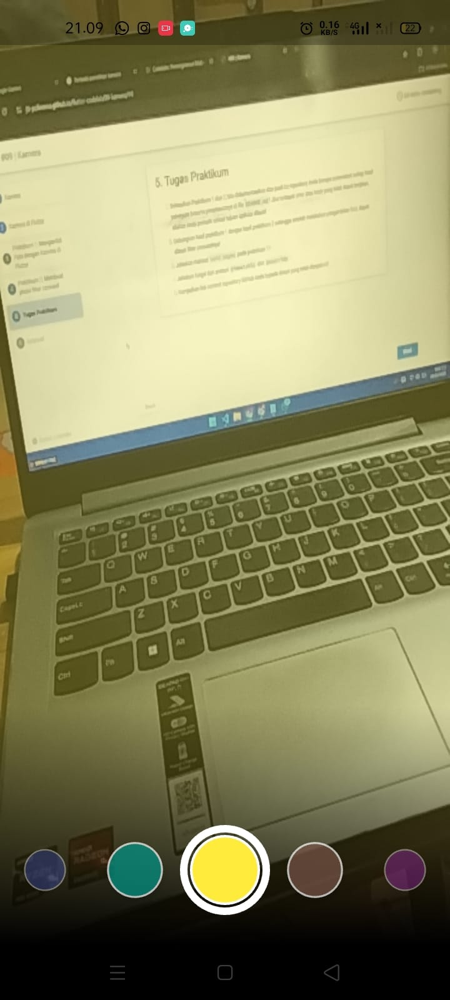
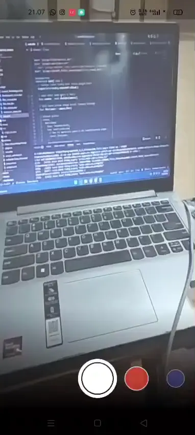

# codelab09_flutter_kamera

A new Flutter project.

## Praktikum 1: Mengambil Foto dengan Kamera di Flutter
1. Hasil dari `lib/widget/takepicture_screen.dart`

    

2. Kemudian setelah gambar diambil, akan ditampilkan menggunakan `lib/widget/displaypicture_screen.dart`

    

## Praktikum 2: Membuat photo filter carousel
Berikut hasil dari penggunaan filter pada kamera

 

 

## Tugas Praktikum

1. Penggabungan hasil praktikum 1 dan praktikum 2

 

2. Maksud void async pada praktikum 1?

    Digunakan agar fungsi `main()` bisa menjalankan proses asinkron seperti `await availableCameras()`. Tanpa async, program tidak bisa memakai `await`.

3. Fungsi dari anotasi @immutable dan @override ?

    - `@immutable` Menandakan bahwa objek kelas tidak boleh diubah setelah dibuat (semua propertinya bersifat final). Biasanya dipakai pada Widget agar datanya tetap.

    - `@override`
Digunakan saat menimpa (mengganti) metode dari kelas induk dengan versi baru di kelas turunan, misalnya `initState()` atau `build()`.

