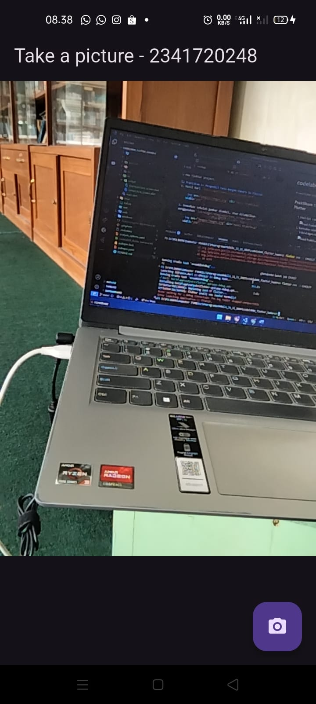
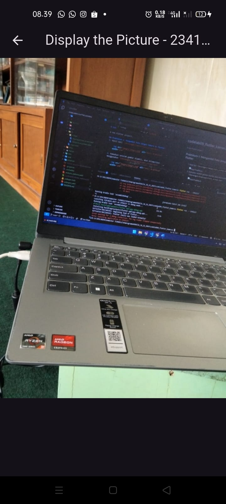

# codelab09_flutter_kamera

A new Flutter project.

## Praktikum 1: Mengambil Foto dengan Kamera di Flutter
1. Hasil dari `lib/widget/takepicture_screen.dart`

    

2. Kemudian setelah gambar diambil, akan ditampilkan menggunakan `lib/widget/displaypicture_screen.dart`

    

## Praktikum 2: Membuat photo filter carousel
Berikut hasil dari penggunaan filter pada kamera

 

 

