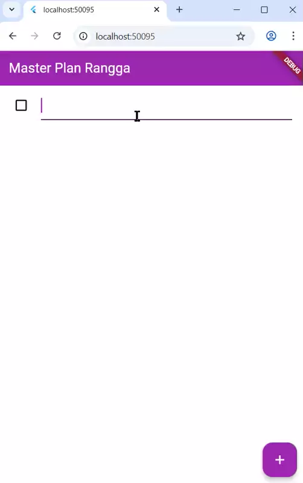
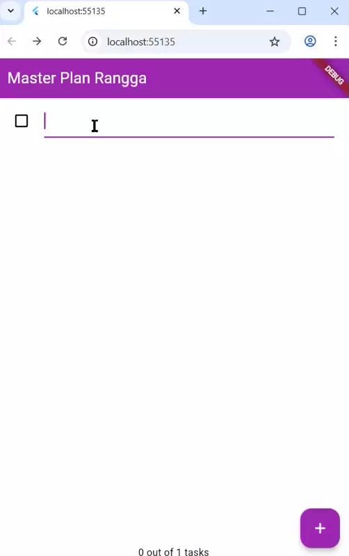

# codelab10_master_plan

A new Flutter project.

## Praktikum 1 : Dasar State dengan Model-View
1. Berikut demonstrasi praktikum 1

     

2. Maksud dari langkah 4:
    ```
    export 'plan.dart';
    export 'task.dart';
    ```
    File ini berfungsi sebagai penghubung. Tujuannya untuk Mempermudah import (lebih bersih dan rapi), Menyatukan ekspor model dalam satu pintu masuk, dan Menghindari duplikasi import di banyak file.

3. Mengapa perlu variabel plan di langkah 6?

    Variabel plan digunakan untuk :
    - Tempat menyimpan data rencana utama
    - Digunakan untuk menampilkan daftar task
    - Diperbarui setiap kali user menambah, mencentang, atau mengubah deskripsi task
    
    Tanpa plan, aplikasi kamu nggak tahu task apa yang harus ditampilkan.

4. Langkah 9 GIF nya digabung di nomer 1

    Langkah 9, `_buildTaskTile` digunakan untuk menampilkan satu baris tugas (task) dalam daftar.
Setiap baris berisi Checkbox untuk menandai apakah tugas sudah selesai, dan TextFormField untuk mengedit deskripsi tugas.

    Saat pengguna mencentang atau mengubah teks, fungsi `setState()` dijalankan untuk memperbarui data plan dengan membuat objek Plan baru yang berisi daftar tugas terbaru.
Dengan begitu, tampilan (UI) akan otomatis diperbarui sesuai perubahan data.

5. Apa kegunaan method pada Langkah 11 dan 13 dalam lifecyle state ?

    `initState()` digunakan saat pertama kali widget dibuat untuk menyiapkan data atau controller, seperti membuat ScrollController dan menambahkan listener agar keyboard tertutup saat daftar discroll.
    Sedangkan dispose() dipanggil saat widget dihapus dari layar untuk membersihkan resource, yaitu menghapus scrollController agar tidak terjadi kebocoran memori.

## Praktikum 2: Mengelola Data Layer dengan InheritedWidget dan InheritedNotifier
1. Berikut demonstrasi praktikum 1

     

    Secara langsung tidak ada perubahan yang signifikan pada tampilan. Untuk perbaikan yang saya lakukan hanya pada file main yang tadinya Provider tidak dikenali, saya tambahkan di bagian import dengan kode ini
    `import './provider/plan_provider.dart';`

2. Jelaskan mana yang dimaksud InheritedWidget pada langkah 1 tersebut! Mengapa yang digunakan InheritedNotifier?

    Yang dimaksud `InheritedWidget` adalah kelas induk (base class) di Flutter yang memungkinkan data dibagikan ke seluruh widget turunan dalam pohon widget (widget tree).

    Pada langkah ini digunakan `InheritedNotifier` karena selain membagikan data (Plan), juga ingin memberi tahu widget lain saat data berubah.
`InheritedNotifier` menggabungkan fungsi `InheritedWidget` dengan `ChangeNotifier`, sehingga tampilan otomatis ter-update ketika nilai `ValueNotifier<Plan>` berubah.

3. Jelaskan maksud dari method di langkah 3 pada praktikum tersebut! Mengapa dilakukan demikian?

    Method di langkah 3 berfungsi untuk menghitung dan menampilkan progres penyelesaian tugas dalam sebuah rencana (plan). Hal ini dilakukan agar aplikasi bisa menampilkan informasi kemajuan plan secara otomatis tanpa perlu menghitung manual di UI setiap kali data berubah.

## Praktikum 3: Membuat State di Multiple Screens
1. Berikut demonstrasi praktikum 1

     

2. Berdasarkan Praktikum 3 yang telah Anda lakukan, jelaskan maksud dari gambar diagram di soal
3. 
