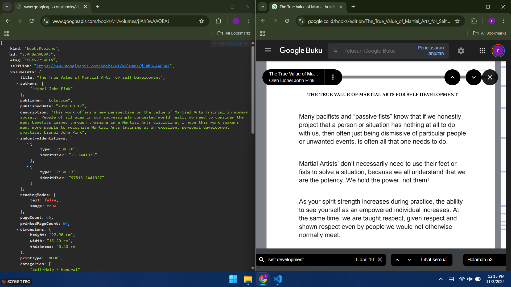

# codelab11_books

A new Flutter project.

## Praktikum 1: Mengunduh Data dari Web Service (API)

**Soal no 1. Tambahkan nama panggilan pada `title` app sebagai identitas**

```bash
@override
  Widget build(BuildContext context) {
    return MaterialApp(
      title: 'Ranggga Dwi Saputra',
      theme: ThemeData(
        primarySwatch: Colors.blue,
        visualDensity: VisualDensity.adaptivePlatformDensity,
      ),
      home: const FuturePage(),
    );
  }
```

<br>

**Soal no 2. Cari judul buku di Google Books, lalu ganti `ID` buku pada variabel path di kode tersebut. Kemudian akses di browser URI tersebut untuk menampilkan data JSON**



<br>

**Soal no 3. Capture hasil praktikum berupa GIF**

 

