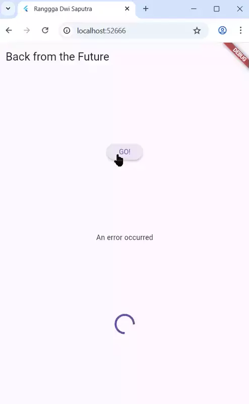
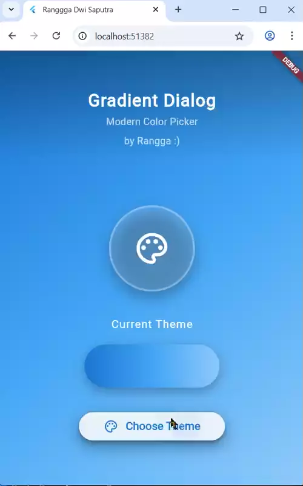

# codelab11_books

A new Flutter project.

## Praktikum 1: Mengunduh Data dari Web Service (API)

**Soal no 1. Tambahkan nama panggilan pada `title` app sebagai identitas**

```bash
@override
  Widget build(BuildContext context) {
    return MaterialApp(
      title: 'Ranggga Dwi Saputra',
      theme: ThemeData(
        primarySwatch: Colors.blue,
        visualDensity: VisualDensity.adaptivePlatformDensity,
      ),
      home: const FuturePage(),
    );
  }
```

<br>

**Soal no 2. Cari judul buku di Google Books, lalu ganti `ID` buku pada variabel path di kode tersebut. Kemudian akses di browser URI tersebut untuk menampilkan data JSON**

Link buku asli : https://www.google.co.id/books/edition/The_True_Value_of_Martial_Arts_for_Self/jJAhBwAAQBAJ?hl=id&gbpv=1&dq=self+development&pg=PA52&printsec=frontcover


<br>

**Soal no 3. Capture hasil praktikum berupa GIF**

Maksud kode langkah 5 tersebut terkait `substring` dan `catchError!` adalah Kode tersebut menampilkan tombol `“GO!”` yang ketika ditekan akan memanggil fungsi `getData()`. `substring` digunakan untuk membatasi panjang teks yang ditampilkan, sedangkan `catchError` digunakan untuk menangani kesalahan agar program tidak berhenti tiba-tiba.

Capture hasil:  
 

## Praktikum 2: Menggunakan await/async untuk menghindari callbacks
**Soal no 4. Maksud kode langkah 1 dan 2**

Kode tersebut menjalankan tiga fungsi asynchronous yang masing-masing menunggu 3 detik lalu mengembalikan angka 1, 2, dan 3. Fungsi `count() ` memanggil ketiganya secara berurutan (sequential), menjumlahkan hasilnya menjadi 6, lalu menampilkan hasil itu ke UI dengan `setState()`. Total waktu eksekusi sekitar 9 detik.

Capture hasil:  
 

## Praktikum 3: Menggunakan Completer di Future

**Soal no 5. Jelaskan maksud kode langkah berikut**

```bash
late Completer completer;

Future getNumber() {
  completer = Completer<int>();
  calculate();
  return completer.future;
}

Future calculate() async {
  await Future.delayed(const Duration(seconds : 5));
  completer.complete(42);
}
```


Kode ini membuat Future yang tidak langsung selesai, tapi baru diselesaikan setelah 5 detik dengan nilai 42.
Completer memberi kontrol penuh kapan dan dengan apa Future tersebut dianggap selesai.

Capture hasil:

 


**Soal no 6. Jelaskan maksud perbedaannya dengan langkah berikut**
```bash
Future calculate2() async {
    try {
      await Future.delayed(const Duration(seconds: 5));
      throw Exception('Simulated error'); // ini memicu error
      // completer.complete(42);  jika ini dinonaktifkan, maka akan memicu error oleh catch
    } catch (e) {
      completer.completeError(e);
    }
  }
----------------------------
onPressed: () {
    getNumber().then((value) {
        setState(() {
            result = value.toString();
            });
        });
        setState(() {
            result = 'An error occurred';
        });
    },

```
- Untuk kode sebelumnya kalau terjadi error, tidak ada mekanisme untuk menangani kesalahan (`try-catch` tidak ada). Akibatnya, jika ada error, program bisa crash.
- Sedangkan block kode kedua tahan terhadap error karena memisahkan jalur sukses dan gagal dengan jelas menggunakan `try-catch` di `calculate()` dan `.catchError()` di `onPressed()`

Capture hasil:  
 

## Praktikum 4: Memanggil Future secara paralel

**Soal no 7. Capture hasil praktikum 4**, hasilnya dalam 3 detik berupa angka 6 muncul lebih cepat dibandingkan praktikum sebelumnya yang menunggu sampai 9 detik.

 

**Soal no 8. Perbedaan kode** :
- `Future.wait` untuk menunggu sekelompok tugas asinkron yang Anda ketahui semuanya di awal. Ini adalah pilihan utama untuk konkurensi.
- `FutureGroup` (jika tersedia melalui paket tambahan) hanya ketika Anda perlu mengumpulkan tugas asinkron secara bertahap selama runtime sebelum memutuskan untuk menunggu semuanya.

## Praktikum 5: Menangani Respon Error pada Async Code

**Soal no 9. Capture hasil praktikum 5**

 

**Soal no 10. Perbedaan langkah kode**
```bash
// mengembalikan error secara asynchronous setelah menunggu 2 detik
  Future returnError() async {
    await Future.delayed(const Duration(seconds: 2));
    throw Exception('Something terrible happened!');
  }

  // menangani error dari returnError menggunakan try-catch-finally
  Future handleError() async {
    try {
      await returnError();
    } catch (error) {
      setState(() {
        result = error.toString();
      });
    } finally {
      print('Complete');
    }
  }
```

- `returnError()` adalah fungsi yang menciptakan/melempar (throws) sebuah error asinkron setelah jeda waktu.
- `handleError()` adalah fungsi yang mengonsumsi dan menangani (handles) error yang dilempar oleh `returnError()` menggunakan struktur `try-catch-finally` yang aman.

Panggil method `handleError()` tersebut di `ElevatedButton`, lalu run. Capture hasil:

 

## Praktikum 6: Menggunakan Future dengan StatefulWidget

**Soal no 11. Tambahkan identitas**
```bash
Widget build(BuildContext context) {
    return Scaffold(
      appBar: AppBar(title: const Text('Rangga`s Location')),
      body: Center(child: Text(myPosition)),
    );
  }
```

Capture hasil :


**Soal no 12. Tambahkan delay pada method getPosition() dengan kode await Future.delayed(const Duration(seconds: 3));**

Capture hasil :


Kode ini Tidak bisa mendapatkan koordinat GPS secara langsung ketika dijalankan di browser (Flutter Web) dengan `geolocator`. Karena Tidak ada akses langsung ke sensor GPS.
Browser hanya bisa memperkirakan lokasi lewat: IP address, Wi-Fi, atauizin lokasi dari user.
Jadi hasilnya bisa tidak akurat, atau tidak muncul sama sekali.

## Praktikum 7: Manajemen Future dengan FutureBuilder

**Soal no 13.**

Walaupun logikanya berbeda, tujuan akhirnya sama yaitu :Menampilkan loading spinner `(CircularProgressIndicator)` saat data lokasi belum ada. dan Menampilkan teks hasil koordinat saat data lokasi sudah berhasil diambil.

Perbedaannya hanya di cara Flutter memproses data:
- Versi `setState()` → UI diperbarui secara manual setelah data lokasi didapat dengan memanggil `setState()`.
- Versi `FutureBuilder()` → UI diperbarui secara otomatis berdasarkan status Future (menunggu, selesai, error).

**Soal no 14.** Capture hasil modifikasi


Saat GPS saya matikan, tidak muncul pesan kesalahan, melainkan indikator spinner yang terus berputar tanpa henti.

## Praktikum 8 : Navigation route dengan Future Function

**Soal no 15.** tambahkan identitas pada title

```bash
@override
  Widget build(BuildContext context) {
    return Scaffold(
      backgroundColor: color,
      appBar: AppBar(title: const Text('Navigation by Rangga')),
      body: Center(
        child: ElevatedButton(
          child: const Text('Change Color'),
          onPressed: () {
            _navigateAndGetColor(context);
          },
        ),
      ),
    );
  }
```

**Soal 16. Capture Hasil :**

| Asli Jobsheet                 | Modifikasi dengan warna Favorit                                                                   |
| --------------------- | ------------------------------------------------------------------------- |
|                  |                  | 

## Praktikum 9 : Memanfaatkan async/await dengan Widget Dialog

**Soal no 17. Capture Hasil**
| Asli Jobsheet                 | Modifikasi dengan warna Favorit                                                                   |
| --------------------- | ------------------------------------------------------------------------- |
|                  |                  |

