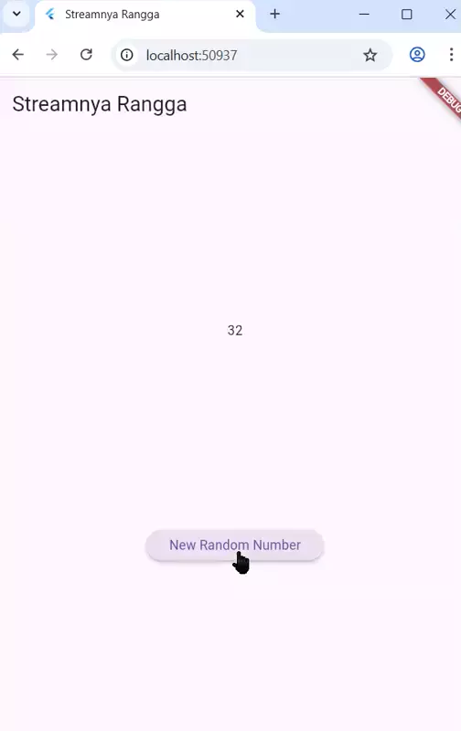
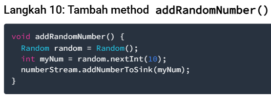
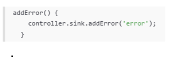
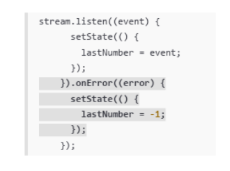
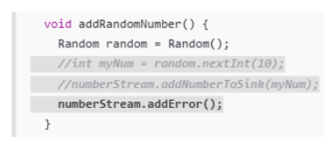
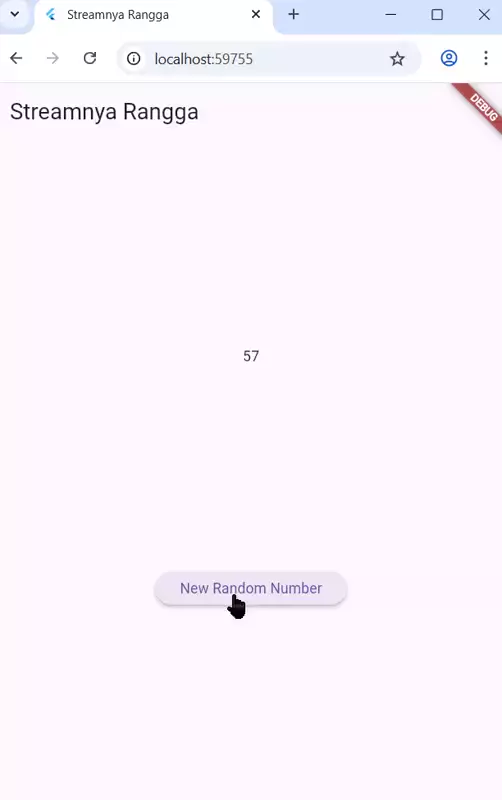
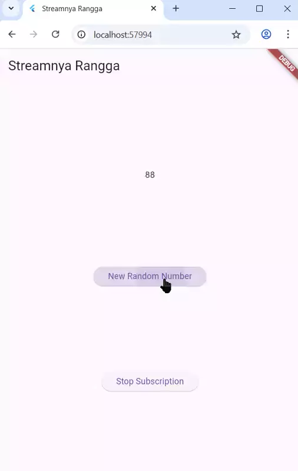
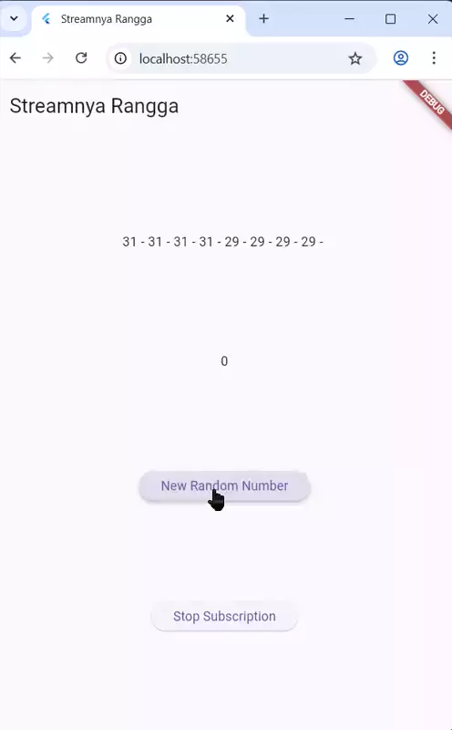
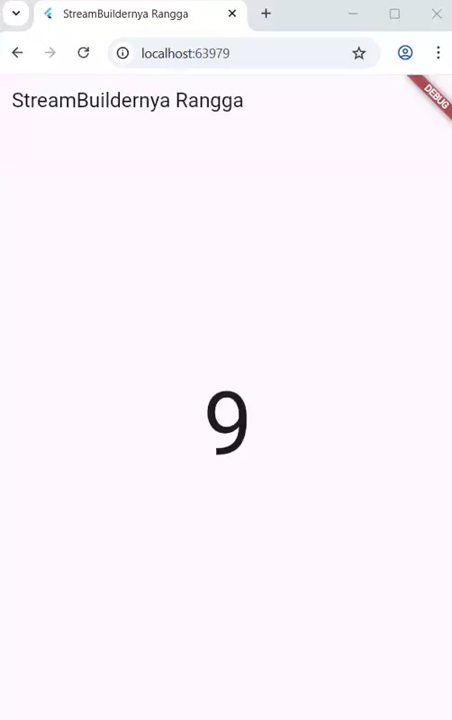
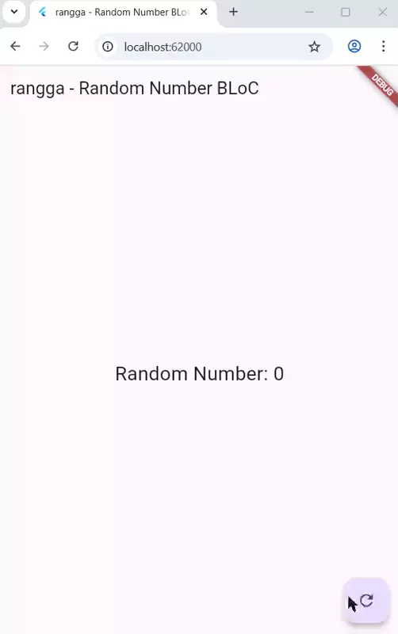

# codelab12_stream_rangga

A new Flutter project.

## Praktikum 1: Dart Streams

> Praktikum ini untuk mengimplementasikan manajemen state asinkron dan dinamis pada sebuah widget dengan cara menggunakan Dart Streams sebagai sumber data (seperti, urutan warna) yang terus mengalir dan mengkonsumsi Stream tersebut menggunakan metode `.listen()` di dalam StatefulWidget untuk memicu pembaruan antarmuka `(setState)` setiap kali data baru diterima.

Urutan proses : 
- Pembuatan `class ColorStream`
- menggunakan methode `.listen()` didalam `StatefulWidget`
- pemanggilan `setState()` untuk mengubah variabel warna latar belakang (`_bgColor`)

Capture hasil :


Soal-soal :

**[3]** Jelaskan fungsi keyword yield* pada kode berikut dan apa maksud perintahnya !
```bash
yield* Stream.periodic(
  const Duration(seconds: 1), (int t) {
    int index = t % colors.length;
    return colors[index];
});
```
- `yield*` dipakai untuk “meneruskan” semua data dari sumber lain ke dalam stream atau iterable sekarang.

- Kode tersebut membuat dan menghasilkan Stream yang secara berkala (setiap 1 detik) mengeluarkan objek Color secara berurutan.

**[5]** Perbedaan menggunakan listen dan await for (langkah 9) 

> `!listen()` mendengarkan data secara terus-menerus tanpa menunggu selesai, sedangkan await for menunggu setiap data sampai aliran berakhir sebelum lanjut ke kode berikutnya. 

## Praktikum 2: Stream controllers dan sinks

Capture hasil :



**[6]** Penjelasan kode berikut :
| Kode langkah 8                 | Kode langkah 10                                                                    |
| --------------------- | ------------------------------------------------------------------------- |
|                  |                  | 

- *Langkah 8*, Mengatur langganan (`listen`) ke Stream segera setelah widget dibuat (`initState`) dengan cara Setiap kali Stream mengirimkan nilai baru (`event`), listen menangkapnya, dan setState dipanggil untuk memperbarui variabel `lastNumber` yang ditampilkan di UI.
- *Langkah 10*, Mengirimkan data baru ke dalam Stream. Fungsi ini menghasilkan angka acak (`myNum`) antara 0 dan 9, lalu menggunakan `numberStream.addToSink(myNum)` (atau `controller.sink.add(myNum)`) untuk memasukkan angka tersebut ke dalam Stream. Angka ini kemudian akan ditangkap oleh `listen` di Langkah 8.

**[7]** Penjelasan kode berikut :

| Kode langkah 13 & 14                 | Kode langkah 15                                                                    |
| --------------------- | ------------------------------------------------------------------------- |
|                   |                  | 

* *Langkah 13-14*, Pada `stream.listen`, ditambahkan parameter `onError`. Ketika sinyal eror terdeteksi, fungsi `onError` dijalankan. `setState` digunakan untuk mengubah lastNumber menjadi -1, memberikan indikasi visual bahwa terjadi kesalahan.
* *Langkah 15*, setiap kali fungsi ini dipanggil (seperti saat menekan tombol), ia langsung menggunakan `numberStream.addError()` untuk mengaktifkan alur error handling yang telah diatur pada listen di Langkah 14.

## Praktikum 3: Injeksi data ke streams

Hasil capture :




**[8]** Jelaskan maksud kode berikut


* *Langkah 1*, Mendeklarasikan variabel bernama `transformer` di dalam `_StreamHomePageState`. Variabel ini akan menyimpan objek yang bertanggung jawab untuk mengubah aliran data dari Stream. Kata kunci `late` digunakan karena variabel ini akan diinisialisasi nanti di dalam `initState()`, bukan saat deklarasi kelas.
* *Langkah 2*, Menginisialisasi ``transformer` dengan logika spesifik. 
    - `handleData` mengalikan data dengan 10, 
    - `handleError` mengganti hasil dengan nilai -1, dan 
    - `handleDone` memastikan sink (saluran keluar) ditutup ketika `Stream` sumber selesai.
* *Langkah 3*, Menerapkan Transformer ke Stream dan memulai pendengaran data. Penting untuk memastikan Langkah 2 (inisialisasi) berada sebelum Langkah 3 (penggunaan), untuk menghindari runtime error.

## Praktikum 4: Subscribe ke stream events

Hasil Capture :



**[9]** Jelaskan maksud kode berikut

[a] Edit initState()
```bash
@override
  void initState() {
    numberStream = NumberStream();
    numberStreamController = numberStream.controller;
    Stream stream = numberStreamController.stream;
    subscription = stream.listen((event) {
      setState(() {
        lastNumber = event;
      });
    });
    subscription.onError((error) {
      setState(() {
        lastNumber = -1;
      });
    });
    subscription.onDone(() {
      print('OnDone was called');
    });
    super.initState();
  }
```
> `stream.listen(...)` membuat subscription, yaitu pendengar yang akan bereaksi setiap kali stream mengirim data baru → event dikirim ke listener lewat `add()` → `lastNumber` diperbarui di layar didalam `setState`. Kalau ada error → variabel lastNumber diubah jadi -1. `onDone()` dipanggil saat stream ditutup `(controller.close())` untuk membersihkan sumber daya atau menampilkan pesan “stream selesai”.

[b] Pindah ke method dispose()
```bash
subscription.cancel();
```
> Kode ini berfungsi untuk menghentikan langganan Stream (subscription) saat widget dihapus dari layar.
Tujuannya untuk mencegah kebocoran memori (memory leak) karena Stream masih berjalan padahal widget sudah tidak aktif.

[c] Edit method addRandomNumber()
```bash
void addRandomNumber() {
    int myNum = Random().nextInt(100);
    numberStream.addNumbertoSink(myNum);
    // numberStreamController.addError();
    if (!numberStreamController.isClosed) {
      numberStream.addNumbertoSink(myNum);
    } else {
      setState(() {
        lastNumber = -1;
      });
    }
  }
```
> Method ini digunakan untuk mengirimkan angka acak ke Stream.
Jika StreamController masih aktif (belum ditutup), angka baru dikirim ke Stream.
Jika sudah ditutup, UI menampilkan -1 sebagai tanda error atau kondisi tidak valid.


## Praktikum 5: Multiple stream subscriptions

**[10]** Penjelasan error


> Eror tersebut terjadi karena mencoba mendengarkan (listen) ke Stream yang sama sebanyak dua kali. Padahal Stream jenis ini dirancang hanya untuk satu pendengar (listener). Setelah dipanggil `.listen()` untuk pertama kalinya, Stream tersebut akan aktif dan mulai mengirimkan data.

Hasil Capture : 




**[11]** Penjelasan hasil :

> Hal ini terjadi karena adanya dua listener aktif yang menerima setiap angka yang dikirim ke Stream, sehingga setiap angka dicatat dan ditambahkan ke variabel values sebanyak dua kali.

## Praktikum 6: StreamBuilder

Capture Hasil :



**[12]** Jelaskan maksud kode berikut

* *Langkah 3*, Kode di file `stream.dart` dan berisi implementasi class `NumberStream`. Maksud utamanya adalah untuk membuat dan mengalirkan (stream) sebuah urutan bilangan bulat acak secara terus-menerus.
* *Langkah 7*, di dalam method `build()` pada file `main.dart` dan menggunakan `widget StreamBuilder`. Maksud utamanya adalah untuk membangun (merender) UI secara reaktif berdasarkan data terbaru yang diterima dari `numberStream`.

## Praktikum 7: BLoC Pattern

Capture Hasil :



**[13]** Letak konsep pola BLoC-nya

> Praktikum 7 ini bertujuan untuk memperkenalkan dasar-dasar State Management di Flutter menggunakan pola arsitektur BLoC (Business Logic Component). Praktikum ini menunjukkan cara memisahkan logika aplikasi dari antarmuka pengguna (UI). Konsep pola BLoC terletak pada implementasi tiga komponen utamanya: Sinks (Events), BLoC (Logic), dan Streams (States), yang secara efektif mengontrol aliran data searah (Uni-directional Data Flow).
