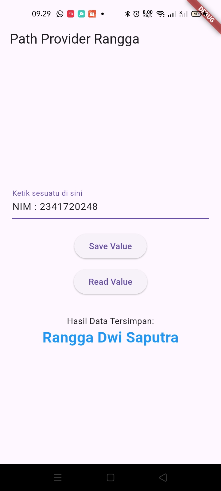
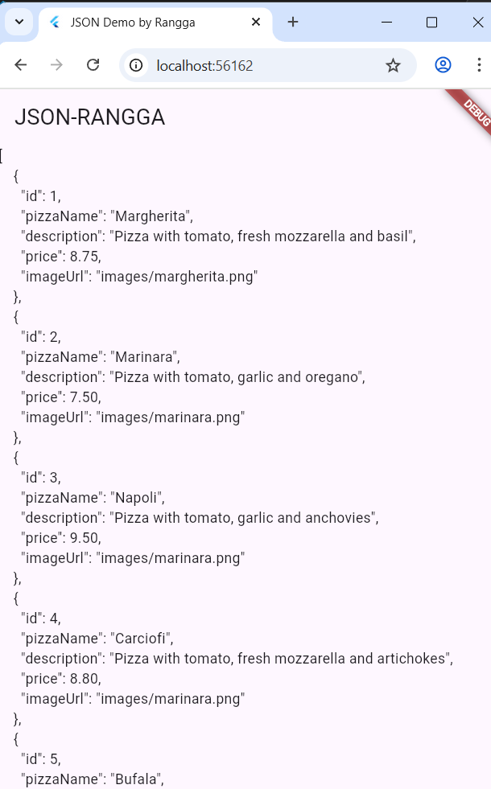
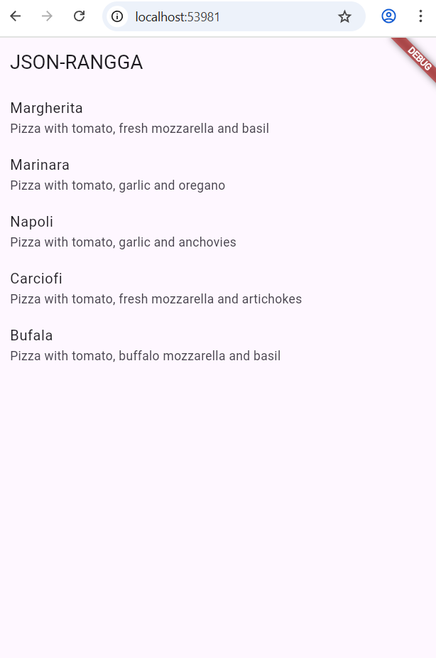
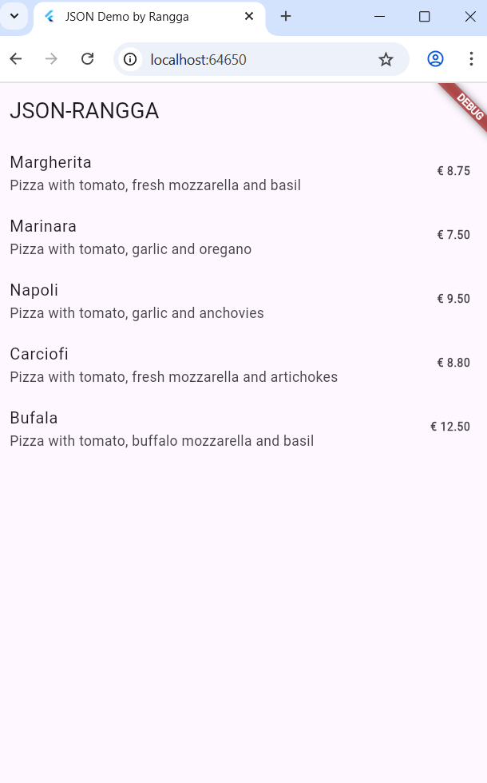
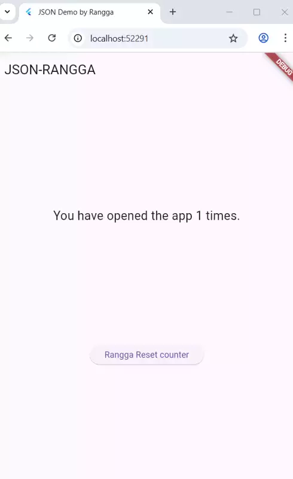
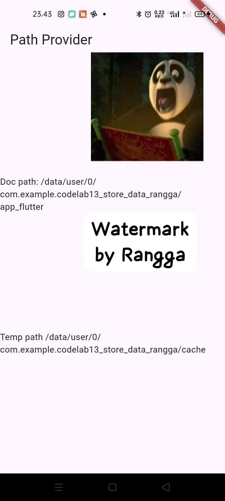
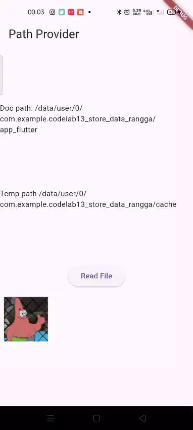

# codelab13_store_data_rangga

A new Flutter project.

## Getting Started

Hasil Akhir Praktikum

Hasil Capture :


| Image Demonstrasi                 | GIF Demonstrasi                                                                    |
| --------------------- | ------------------------------------------------------------------------- |
|                  | 

# Praktikum 1: Konversi Dart model ke JSON

Hasil capture :

| Hasil Json                 | Objek List Dart                                                                    |
| --------------------- | ------------------------------------------------------------------------- |
|                  | 

# Praktikum 2: Handle kompatibilitas data JSON

Hasil capture :



# Praktikum 3: Menangani error JSON

Jelaskan maksud kode lebih safe dan maintainable!
> `Safe` Kode ditulis dengan cara yang meminimalkan risiko error, bug, dan celah keamanan. Contohnya: validasi input, penanganan error yang baik, dan tidak menggunakan cara-cara yang berpotensi merusak sistem.

> `Maintainable`
Kode mudah dibaca, mudah dipahami, dan mudah diperbaiki atau dikembangkan oleh programmer lain maupun diri sendiri di masa depan. Contohnya: struktur rapi, penggunaan fungsi/class yang jelas, dan komentar seperlunya.

# Praktikum 4: SharedPreferences

Hasil capture :



# Praktikum 5: Akses filesystem dengan path_provider

Hasil capture:



# Praktikum 6: Akses filesystem dengan direktori

Hasil capture :



***Jelaskan maksud kode ini***

```bash
Future<bool> writeFile() async {
  try {
    await myFile.writeAsString('Margherita, Capricciosa, Napoli');
    return true;
  } catch (e) {
    return false;
  }
}
```

> `writeFile()` menulis data pizza ke dalam file.
Ketika tombol “Read File” ditekan, aplikasi membaca file tersebut dan memecah isi teksnya menjadi list, sehingga bisa ditampilkan di layar.

# Praktikum 7: Menyimpan data dengan enkripsi/dekripsi

Hasil Capture :


| Image Demonstrasi                 | GIF Demonstrasi                                                                    |
| --------------------- | ------------------------------------------------------------------------- |
|                  | 


