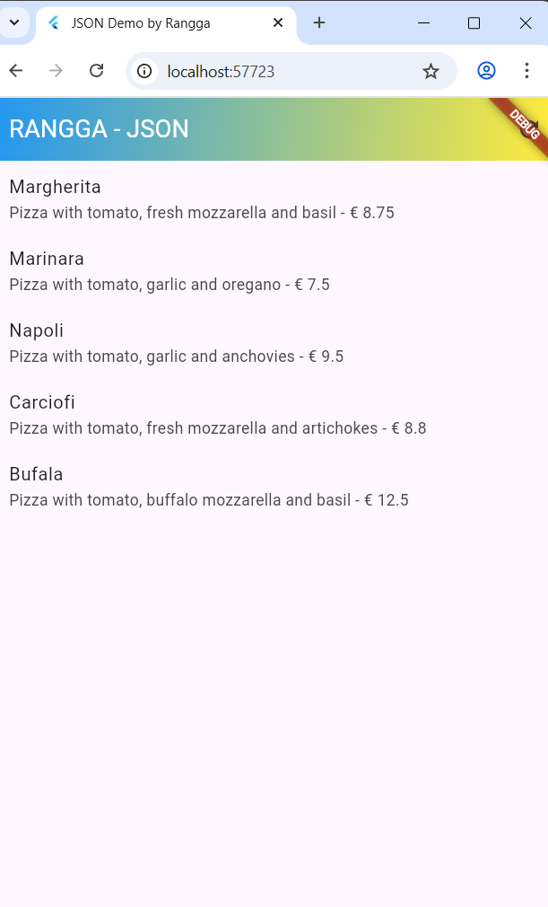
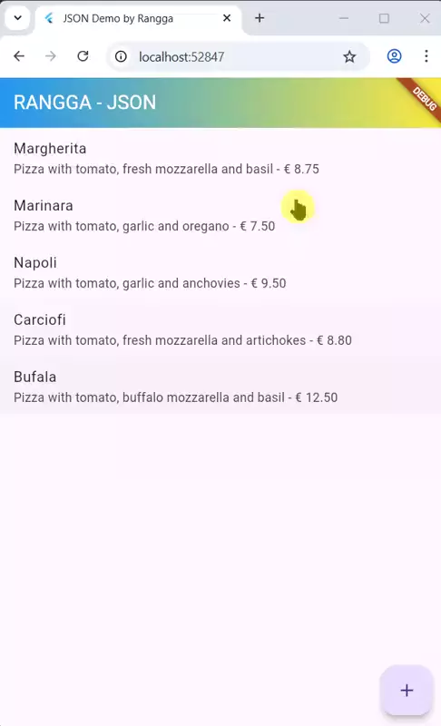

# codelab13_store_data_rangga

A new Flutter project.

## Getting Started

Hasil Akhir Praktikum

Hasil Capture :

| GET                 | POST         
| ----------------- | -------------- 
|  | |

|PUT              |DELETE       |
|-------------- |-------------- |
 | |
